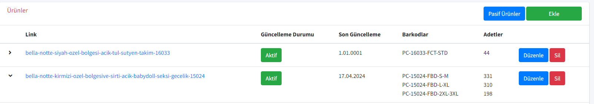
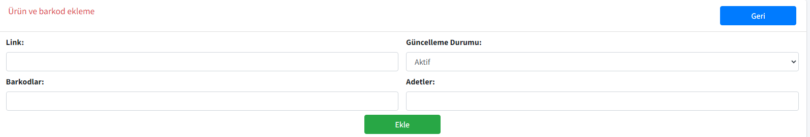
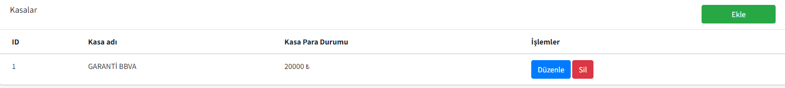
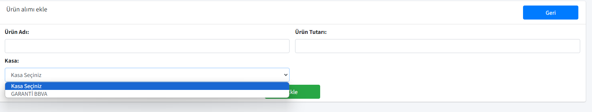
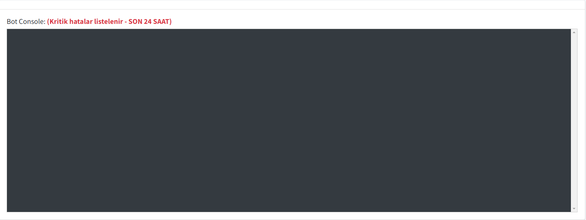
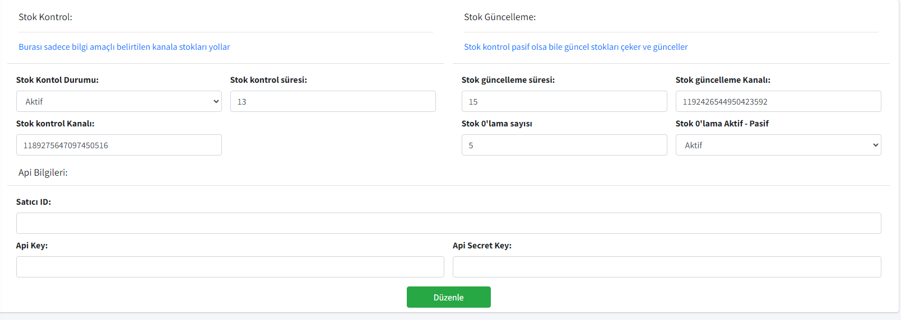

# ClebWeb Bot Kontrol (.NET - JS - MSSQL)

🔧 Clebweb adlı botu kontrol etmek için yapılmıştır. Trendyol API ayarlarını, hangi ürünleri çekeceği/güncelleyeceği ve mesajların hangi kanala gönderileceği gibi özellikler kontrol edilebilir.

- Ürünlerin kontrol edilmesi ve eklenmesi
- Kullanıcı yönetimi
- Kasa işlemleri: Kasa ekleyip bütçenizi kontrol edebilirsiniz
- Ürün satın alma işlemleri: Aldığınız ürünü belirlediğiniz kasadan fiyatını düşürebilirsiniz
- Log işlemleri: Botun son 24 saatte verdiği hataları görebilirsiniz
- Bot ayarları

## Özellikler

### Ürün Kontrolü

📦 Kontrol edilecek ürünleri ekleyebilir ve güncelleyebilirsiniz.

### Kullanıcı Yönetimi

👤 Kullanıcıların erişim düzeylerini yönetebilirsiniz.

### Kasa İşlemleri

💰 Kasa ekleyebilir ve bütçenizi kontrol edebilirsiniz.

### Ürün Satın Alma İşlemleri

🛒 Belirlediğiniz kasanızdan ürün satın alabilirsiniz.

### Log İşlemleri

📝 Botun son 24 saatte verdiği hataları görebilirsiniz.

### Bot Ayarları

⚙️ Botun çalışma ayarlarını yönetebilirsiniz.

## İlişkili Projeler

### Botun kodları

Bu projenin bir parçası olan Bot'un kodlarına göz atabilirsiniz:

[Bot Projesi](https://github.com/beytullahtapan/ClebWebBotu)